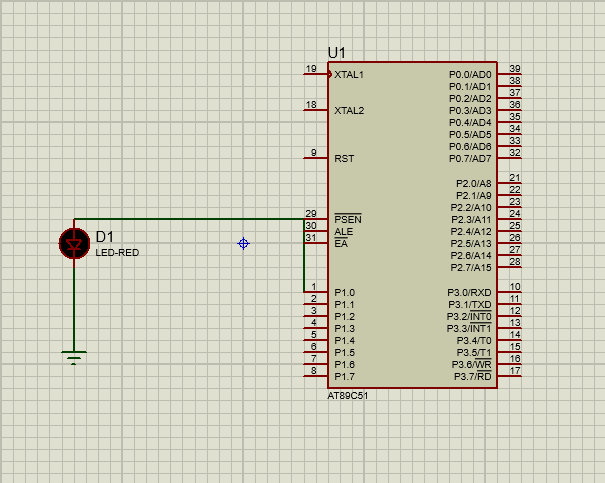

# 🚦 Single LED Blink Using AT89C51 Microcontroller

## 💡 Project Experience
In this project, I worked with the AT89C51 microcontroller to blink a single LED connected to Port 1, Pin 0 (P1.0). I wrote the code in Keil µVision 5, generated the HEX file, and then created the circuit in Proteus for simulation. I manually set the clock frequency to 11.0592 MHz; for real hardware, the LED should be connected with a series current-limiting resistor.

- This project helped me understand the basics of:
    - Writing simple I/O code for the 8051,
    - Using software delay loops,
    - Simulating microcontroller circuits in Proteus,
    - Setting microcontroller properties for clock frequency.

## 📁 Source Code
```c
#include <reg51.h>

void main(){
    volatile unsigned int i;
    while(1) {
        P1 = 0x01;              // Turn ON LED on P1.0
        for(i = 0; i < 30000; i++);  // Delay loop
        P1 = 0x00;              // Turn OFF LED
        for(i = 0; i < 30000; i++);  // Delay loop

    }
}
```

## 🔧 Description

> This is a simple LED blinking project using the AT89C51 microcontroller from the 8051 family. The purpose of the project is to blink an LED connected to Port 1, Pin 0 (P1.0).


## 🛠️ Virtual Hardware Used (in Proteus)
- AT89C51 Microcontroller – The main controller running the blinking code.
- LED – Connected to P1.0 to indicate output status.
- Ground Terminal (GND) – Connected to the LED cathode and microcontroller where necessary.
- No external resistor in this simulation-only setup. For real hardware, always use a current-limiting resistor (typically 220Ω–1kΩ) in series with the LED.
- No external crystal oscillator – Instead, I set the clock frequency to 11.0592 MHz directly in the microcontroller’s properties.
- No external VCC or power supply – Proteus automatically powers the circuit during simulation, so I didn’t add any virtual VCC terminal.


## 🔌 Circuit Diagram

- Here’s a typical LED blinking circuit using the AT89C51:
    >


## ▶️ Demonstration Video

- Here’s a short demonstration of the LED blinking on a simulated Proteus setup:
  > https://github.com/user-attachments/assets/3d7dd73f-dadc-4ec4-9ab1-4d803d69719c


## ⭐ Getting Started

- Write and compile the code in Keil µVision 5 (make sure reg51.h is included).
- Generate the HEX file by building the project (Build Target or press F7).
- Open Proteus and place the AT89C51 microcontroller and LED in the workspace.
- Connect the LED to P1.0 (no external resistor used in simulation).
- Double-click the microcontroller and set the clock frequency to 11.0592 MHz (no external crystal used).
- Upload the generated HEX file into the microcontroller's properties.
- Start the simulation and observe the LED blinking on and off.
