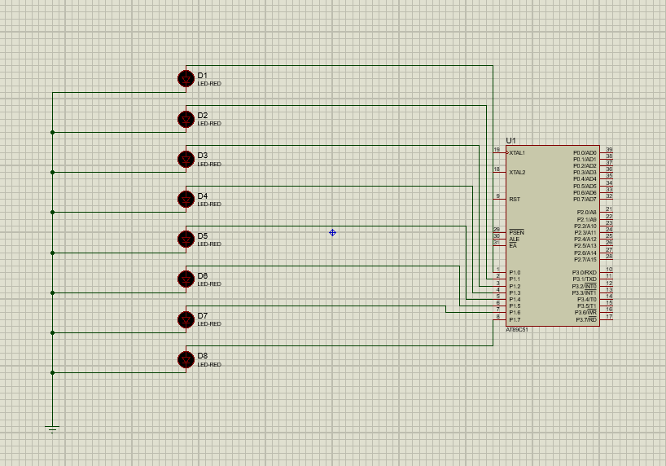

# 🚦 LED Chaser Using AT89C51 Microcontroller

## 💡 Project Experience
This project is very similar to the basic LED blinking project I did earlier. The main difference is that instead of blinking a single LED on P1.0, this code lights one LED at a time across all 8 pins of Port 1 in sequence, creating a "chaser" effect.

Like before, I wrote the code in Keil µVision 5, generated the HEX file, and simulated the circuit in Proteus. The virtual hardware used is the same — AT89C51 microcontroller with LEDs on Port 1 pins, and the clock frequency set manually to 11.0592 MHz. For real hardware, each LED should use a series current-limiting resistor.

- The experience reinforced my understanding of:
	- Using bitwise shift operations to move the LED pattern,
	- Implementing software delays,
	- Simulating microcontroller projects in Proteus,
	- Handling port operations on the 8051 microcontroller family.

## 📁 Source Code
```c
#include <reg51.h>   // Include the 8051 microcontroller register definitions

void main()
{
    unsigned char x, y;        // Variables for LED pattern and loop counter
    volatile unsigned int i;   // Delay loop counter
    
    P1 = 0x00;                 // Initialize Port 1 to 0 (all LEDs OFF)
    
    while(1)                   // Infinite loop to keep running the LED pattern
    {
        x = 0x01;              // Start with the least significant bit set (00000001)
        for(y = 0; y < 8; y++) // Loop 8 times to shift the LED across all 8 bits of Port 1
        {
            P1 = x;            // Output the current pattern to Port 1 (turn ON one LED at a time)
            for(i = 0; i < 35000; i++);   // Software delay loop to keep the LED ON long enough to be visible
            x = x << 1;        // Shift the pattern one bit to the left to move the LED to the next position
        }
    }
}
```

## 🔧 Description

> This project uses the AT89C51 (8051 family) to light one LED at a time across Port 1 (P1.0 to P1.7), creating a running LED chaser effect with software delay.


## 🛠️ Virtual Hardware Required (for LED Chaser Project in Proteus)
- AT89C51 Microcontroller — Runs the LED chaser program.
- 8 LEDs — Connected to Port 1 pins (P1.0 to P1.7) to display the chasing effect.
- Ground (GND) — Common ground connected to the LEDs and microcontroller.
- No external resistors in this simulation-only setup. For real hardware, use a current-limiting resistor (typically 220Ω–1kΩ) in series with each LED.
- No external crystal oscillator — Clock frequency set manually inside the microcontroller properties.
- Power Supply — Not required explicitly; Proteus powers components automatically in simulation.


## 🔌 Circuit Diagram

- Here’s a typical LED chaser circuit using the AT89C51:
    >


## ▶️ Demonstration Video

- Here’s a short demonstration of the LED chaser on a simulated Proteus setup:
	> https://github.com/user-attachments/assets/d61eff10-469c-45e6-b3ae-0059e49165a0


## ⭐ Getting Started

- Write and compile the LED chaser code in Keil µVision 5 (make sure reg51.h is included).
- Generate the HEX file by building the project (Build Target or press F7).
- Open Proteus ISIS, place the AT89C51 and 8 LEDs connected to Port 1 pins.
- Connect LEDs’ cathodes to GND (common ground).
- Double-click the microcontroller and set the clock frequency to 11.0592 MHz in the properties.
- Upload the generated HEX file into the microcontroller.
- Start the simulation and observe the LEDs lighting sequentially, creating the chaser effect.
